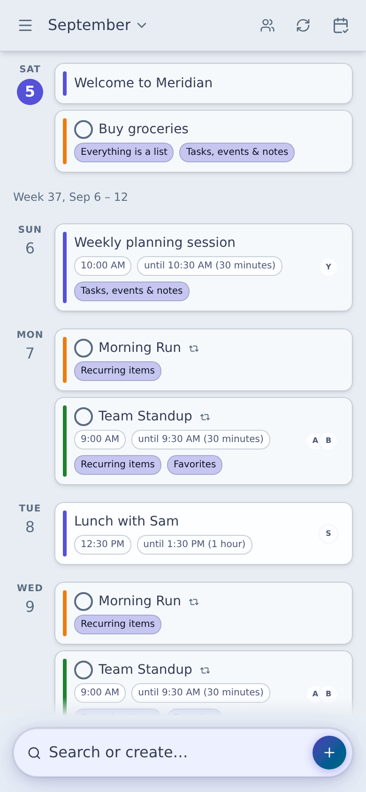

# Meridian

**Tasks and a calendar that are actually good on your phone — stored as plain Markdown files you own.**



**Who it's for:** you keep your life in Markdown — Obsidian, TaskNotes, or just a folder of `.md` files — and you're tired of tasks and dates being something a plugin bolts onto a desktop-first app. In Meridian they're first-class, and they're fast on a phone.

**And whoever you share with doesn't have to be you.** Point Meridian at a repo and everyone you share it with reads and writes the same repo — no vault to configure, no plugins, and no event owned by whoever happened to create it. Write access is a GitHub collaborator invite, so the people you share *with* need a (free) GitHub account. The people you *name* on entries need nothing at all: participants are just names in a file, so a child or a partner can be on the calendar without being a user of anything.

**[Open the app →](https://realjohndoe.github.io/meridian/)** — try the Tutorial vault first, nothing to sign up for.

*Meridian does tasks and calendar. It doesn't try to out-note Obsidian, and doesn't want to.*

---

## Why not just Obsidian + TaskNotes?

That's what I used, and TaskNotes is good. The limit isn't the plugin — it's that a plugin has to work through Obsidian's own interface, which was built for the desktop. Capturing something on a phone takes a couple of taps more than it would in Google Calendar or Todoist, and those taps add up.

|  | Meridian | Obsidian + TaskNotes | Google Calendar / Todoist |
|---|---|---|---|
| Plain Markdown files you own | ✅ | ✅ | ❌ |
| Tasks + calendar first-class, no plugin | ✅ | Plugin-mediated | ✅ |
| Built phone-first | ✅ | Desktop-first | ✅ |
| Second person needs no vault, no plugin, no install | ✅ | ❌ | ✅ |

Only one column has all four.

The first row is the one that can't be added later. Google Calendar and Todoist could ship every other row tomorrow; what they can't do is hand you the files — which is what decides whether your calendar is still yours in five years. [Why files, and not an account →](#why-files-and-not-an-account)

---

## ✨ What it does

**The one thing to judge us on: it's your files, not our database.** Every entry is a plain `.md` file with YAML frontmatter, in a GitHub repo or a folder you picked. Meridian is a static web app with no backend of its own — no Meridian account, no server of ours holding your calendar, no telemetry. Leaving isn't an export feature you have to trust: the storage format **is** the interchange format, so you can grep it, diff it, keep it in git, open it in Obsidian, or hand the folder to whatever you use next — and if that next thing is a calendar rather than a Markdown tool, a vault exports as a single `.ics`. Google Calendar and Todoist can match nearly every bullet below; none of them can match this one. [Why files, and not an account →](#why-files-and-not-an-account)

Everything else:

- **Built for the phone** — one-handed capture and navigation, not a desktop layout squeezed narrow. Add it to your home screen or desktop like any native app (it's a PWA).
- **Recurrence that bends to real life** — daily, weekly, monthly, yearly, custom intervals, weekday-specific patterns, and "repeat N days after completion" — plus per-occurrence overrides and several patterns in one entry, without fiddling with a wizard. [The full model →](#4-a-recurrence-model-that-bends-to-real-life)
- **One kind of entry, on as many lists as you like** — tasks, events and notes are all the same kind of thing, so you never have to decide whether something is a task, a subtask or a project. "Pizza" can sit on *This Week* and on *Cooking* at once; a task can be a subtask of a project and still be tagged, and still hang off an event. [How that works →](#3-lists-model-hierarchies)
- **Agenda, day, and month views** — tasks and events together, in whatever layout suits the moment.
- **Wikilinks** — connect entries with `[[Note Title]]` links that render as inline chips with a preview popover.
- **Participants** — tag people on entries and filter the whole calendar to show only their items.
- **Calendar subscriptions, import and export** — subscribe to an iCal feed (Google, Outlook, Apple, or anywhere else) and see its events alongside your own, read-only; or *import* an `.ics` export into a vault, which turns each event into an ordinary Markdown entry you own and can edit, so moving in doesn't mean retyping your calendar. A vault exports back out as a single `.ics` file to plug into another calendar.
- **Offline-first, and held to it** — the app works without a network connection and syncs when you're back online. Table stakes for anything multi-device, so it's treated that way: [six written invariants](plans/reports/sync-invariants.md) and a generated two-device suite that re-checks them after every operation.
- Plus what you'd expect of any of these apps: **search** across every entry's title and content, and **priority and duration** as first-class fields on any task or event.

---

## 🗄️ Your data, your way

Meridian doesn't run a server that holds your notes. You choose where your files live:

| Backend | How it works |
|---|---|
| **GitHub repository** ⭐ | Reads and writes directly to a repo of your choice via the GitHub API. Instant cloud sync, full git history, and works on any device including iOS. This is the recommended backend for most users. |
| **Local folder** | Opens a folder on your device via the browser's File System API. Files stay on your device. Supported in Chrome or Edge, desktop or Android — not available in Safari or Firefox. |
| **Calendar subscription** | Paste an iCal feed URL — Google, Outlook, Apple, or anywhere else — and its events show up read-only alongside your own. A feed the browser can't fetch directly is relayed through Meridian's own Worker, which doesn't hold your notes any more than the app does. |
| **Tutorial vault** | A built-in demo you can explore before connecting anything — no account needed. |

Files are plain `.md` files. Open them in any text editor, check them into git, sync them with any tool you already use.

### Why files, and not an account

Two things you can't get from a calendar that lives in someone else's account:

**Privacy.** Meridian is a static web app: it runs in your browser and talks to your storage, and that's the whole of it. There's no Meridian account, no server of ours holding your calendar, and no analytics or telemetry anywhere in the app — a private repo stays exactly as private as that repo is. (The one piece of backend is a stateless Worker that trades a GitHub OAuth code for a token and relays iCal feeds a browser can't fetch directly. Your notes never pass through it.)

**Portability.** The usual question for an app like this is whether its export is any good. Here the export isn't the escape route — there's nothing to export *from*, because the storage format is the interchange format. A vault is a directory of `.md` files with YAML frontmatter that a text editor, `grep`, `git`, Obsidian, or the next app you try can all read today, with your edit history in the repo rather than in someone's database. If Meridian stops being what you want, your data is already out.

Neither privacy nor portability can be retrofitted onto a hosted calendar — which is why they lead the comparison at the top of this file, and are the last things here we'd trade away.

### Getting your edits between devices

Files you own only stay yours if your edits actually arrive. That plumbing is table stakes for anything multi-device, so it's treated that way rather than advertised: the sync layer is held to [six written invariants](plans/reports/sync-invariants.md) — *no acknowledged write is lost*, *settled devices agree* — four of them asserted after *every operation* of randomised two-device interleavings (page reloads, a tab closing inside the autosave debounce, a write whose acknowledgement never arrives), and the two liveness ones once the world settles. Not a guarantee: invariant 1 is the sentence this project has broken most often, sixteen separate defects between 11 June and 6 September 2026. The claim is that it's written down and machine-checked, not that it can't happen — and that one file per entry keeps any collision to *that entry*, never the whole calendar.

---

## 🚀 Getting started

1. **Open the app** at [realjohndoe.github.io/meridian](https://realjohndoe.github.io/meridian/).
2. Try the **Tutorial vault** to get a feel for the interface — click through the onboarding tour.
3. When you're ready, connect your own storage:
   - **GitHub** (recommended) — click "Connect GitHub repo", **Sign in with GitHub**, and pick the repository to use — no token to create by hand. Meridian reads and writes files directly, so you can reach your vault from any device.
   - **Local folder** — click "Connect local folder" and pick a directory. Chrome or Edge, desktop or Android; not available in Safari or Firefox.
4. Create your first entry with the **+** button and start building your calendar.

---

<details>
<summary><h2 style="display: inline">📄 Entry format</h2></summary>

Every entry is a Markdown file. Here's a simple weekly task:

```markdown
---
title: Write weekly review
date: 2026-06-27
done: false
priority: high
duration: 30m
repeat:
  type: schedule
  freq: weekly
items:
  - "[[review-q3-goals]]"
  - "[[plan-next-sprint]]"
participants: [alice, bob]
---

Notes about this task go here, in plain Markdown.
```

The `items` list is the task's subtasks — wikilink references to other
entries, just like *Lists model hierarchies* below describes. Meridian fills it in for you
as you link entries in the editor.

Because an entry is a list, recurrence lives in its **occurrences**. You can override or skip any one of them, and even mix several patterns in the same entry — here, exercise repeats every Monday/Wednesday/Friday, with one occurrence already marked done:

```markdown
---
defaults:
  title: Exercise
  done: false
date: 2026-04-06
repeat:
  type: schedule
  freq: weekly
  byweekday: [mo, we, fr]
instances:
  - date: 2026-04-06
    done: true
---

30 min run or gym. Part of [[health-habits]] tracking.
```

You can write and edit these files by hand if you prefer — Meridian will pick up any changes on the next sync.

Frontmatter keys Meridian doesn't use (`aliases`, `cssclasses`, or anything of your own) are kept as they are, so a file stays yours. Saving does rewrite the frontmatter into Meridian's canonical form: comments are dropped, and keys may be reordered, requoted, or moved between the root and a `defaults:` block. The markdown body below the frontmatter is kept as written, apart from trimming blank lines at either end.

</details>

---

## 🙏 Inspiration and comparisons

Meridian was heavily inspired by tools we already loved, and tries to fill the gap where they didn't quite fit together.

| Feature | Meridian | [Obsidian](https://obsidian.md) + [TaskNotes](https://tasknotes.dev/) | [Google Calendar](https://calendar.google.com) | [GitHub Issues / Projects](https://github.com/features/issues) | [Todoist](https://todoist.com) | [Google Keep](https://keep.google.com) |
|---|---|---|---|---|---|---|
| Phone-first UI | ✅ | Desktop-first | ✅ | Partial | ✅ | ✅ |
| Plain Markdown storage | ✅ | ✅ | ❌ | ❌ | ❌ | ❌ |
| Calendar views (day / month) | ✅ | Plugin-dependent | ✅ | Partial | Partial | ❌ |
| Task management | ✅ | ✅ (TaskNotes plugin) | Limited | ✅ | ✅ | Partial |
| Wikilinks between entries | ✅ | ✅ | ❌ | ✅ (`#123` issue links) | ❌ | ❌ |
| Advanced note-taking (plugin ecosystem, graph view, deep linking) | Partial | ✅ | ❌ | ❌ | ❌ | Partial |
| Several recurrence rules in a single entry | ✅ | ❌ (single rule per task) | ❌ (single rule per event) | ❌ | ❌ (single rule per task) | ❌ |
| Multiple participants / assignees | ✅ | Partial | ❌ | ✅ | Partial (one assignee per task) | ❌ |
| Free & open source | ✅ | Partially (plugin only) | ❌ | ❌ | ❌ | ❌ |
| Works in the browser | ✅ | ❌ | ✅ | ✅ | ✅ | ✅ |

**[Obsidian](https://obsidian.md) and the [TaskNotes plugin](https://tasknotes.dev/)** inspired the wikilink system, the plain-Markdown-as-the-source-of-truth philosophy, and much of the editor UX. If you're already an Obsidian user, Meridian's vault format will feel immediately familiar.

To be honest about the comparison: Meridian supports notes, but it doesn't try to be a better note-taking app than Obsidian — Obsidian's plugin ecosystem and note-linking depth are hard to beat, and Meridian doesn't aim to beat them. Meridian's focus is tasks and calendar events, which Obsidian only supports through plugins like TaskNotes; in Meridian they're first-class citizens from day one.

**[Google Calendar](https://calendar.google.com)** set the bar for what recurring events and multi-view calendar navigation should feel like.

**[GitHub Issues and Projects](https://github.com/features/issues)** showed how linking, labelling, and filtering structured entries can work without getting in the way of actual writing.

---

## 💡 The ideas behind Meridian

Four principles, in the order they build on each other: the file format first, then what a file can be, then what one can do over time. They sit below the pitch rather than in it — they explain *why* the app behaves the way it does, which matters more once you're using it than while you're deciding to. Two exceptions: #3 and #4 are reasons to switch in their own right, and both show up in the list at the top.

### 1. Everything is a plain Markdown file

Every entry is a `.md` file with YAML frontmatter — free text for your notes, structured fields for the metadata. Everything below is built on top of this one, and it buys three concrete things:

- **It's yours.** Open, edit, grep, or back up your files with any tool. No lock-in, no proprietary database.
- **It's easy to debug.** When something looks off, you can read the file and see exactly why.
- **It syncs cleanly.** Each item is its own file, so two devices only conflict when they edit *the very same item* — not the whole calendar.

### 2. Different concepts, different lifespans

Tasks, projects, calendar events, notes, and tags stay relevant for different amounts of time: tasks and projects until they're marked done, calendar events until their fixed time passes, and notes and tags indefinitely. Meridian doesn't force these different lifespans into separate apps — it models all of them the same way underneath.

### 3. Lists model hierarchies

That one model is a list. The more abstract concept sits higher, as a **list**, and lists the more concrete concepts below it, as **items** — and because those are references rather than exclusive parent-child slots, an item can sit on more than one list at once.

| Entry | Is a list with… | Its items are usually… |
|---|---|---|
| **Task** | a `done` property | subtasks |
| **Project** | a `done` property | tasks |
| **Event** | a `date`, plus optional `time` and `duration` | agenda points or follow-up tasks |
| **Tag** | — | everything tagged with it |
| **Note** | no special properties | related entries |

What that looks like in use: we keep a **This Week** list for things to finish this week without pinning them to a day, so "Pizza" sits on *This Week* and on *Cooking* at the same time. A strict hierarchy would make Pizza live in exactly one place; a tag could do it, which is why tags are a list here too. Subtasks, projects, backlinks and tags all turn out to be the same idea — a task is a list of subtasks, a backlink is "the lists this appears on" — so you never have to answer "is this a task, a subtask, or a project?" The only question left is whether you want to track it as done. The longer version is in [the post about building it](blog/1-meridian-why-i-built-a-markdown-first-calendar/meridian-why-i-built-a-markdown-first-calendar.md).

### 4. A recurrence model that bends to real life

Real schedules aren't tidy, so Meridian's recurrence model goes well beyond "repeats weekly":

- **Per-occurrence overrides come standard** — cancel or shift a single occurrence without touching the rest of the series.
- **Irregular schedules** — pin one-off occurrences alongside a repeating pattern in the same entry.
- **Multiple series in one entry** — e.g. something on the *first and second Friday* of every month, or a daily check-in that later switches to "2 days after I finish it."
- **Weekday-specific, set-position, interval, and after-completion** rules, in any combination.

---

## Browser support

Meridian uses modern browser APIs (File System Access, IndexedDB, Service Workers). It works best in **Chrome 102+** or **Edge 102+**. Firefox and Safari are supported for most features; local folder access requires a Chromium-based browser.

---

## License

MIT — see [LICENSE](LICENSE).
